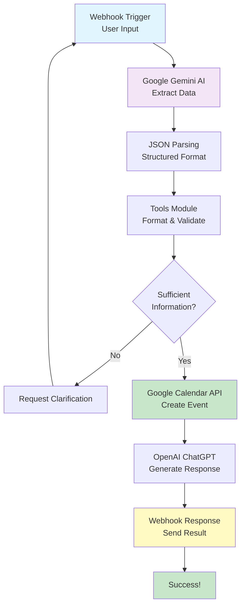

## AI Calendar Assistant — Make.com Automation

An AI-powered calendar automation built using Make.com, Google Gemini, OpenAI, and Google Calendar.

This system automatically converts natural language requests into real calendar events.

Example input:

“Schedule a meeting with John tomorrow at 5 PM”

The automation understands the intent, extracts event details using AI, creates the calendar event, and returns a smart confirmation response.

For more details, read the automation_details.md file    

## the workflow 

## Process Flowchart

